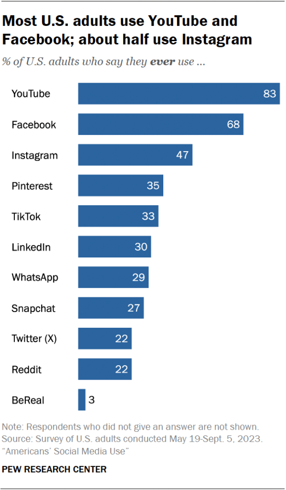
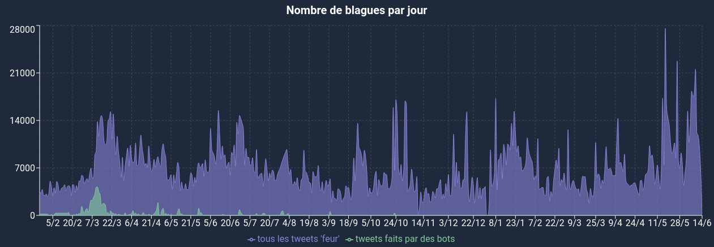

# Liens

- [Contrôle d&#39;internet](https://salle421.eu/2021/05/10/le-controle-dinternet-enjeux-politiques-et-commerciaux/)
- [Censure Wikipédia](https://fr.m.wikipedia.org/wiki/Censure_d'Internet)
- [L&#39;exemple de Cuba](https://fr.wikipedia.org/wiki/Internet_%C3%A0_Cuba)
- [La chine et l&#39;interdiction à internet pour les jeunes](https://www.radiofrance.fr/franceinter/la-chine-restreint-l-acces-a-internet-pour-les-mineurs-une-decision-de-sante-publique-tres-politique-7635350)
- [Libertés sur Internet](https://fr.wikipedia.org/wiki/Libert%C3%A9s_sur_Internet)

apa -> nom auteur (nom du site) date de publication, titre de l'article, [lien](lien)

[https://fr.statista.com/infographie/6789/internet-de-plus-en-plus-censure/](https://fr.statista.com/infographie/6789/internet-de-plus-en-plus-censure)

[https://youtu.be/hUrRBhSh76Y](https://youtu.be/hUrRBhSh76Y) -> Brut, 2021, "Ces technologies nous rendent accro, Envoyé Spécial a rencontré leurs créateurs"

 \
-> Pew Research Center, 2023, "Most U.S. adults use YouTube and Facebook; about half use Instagram"

[https://www.lemonde.fr/idees/article/2022/04/20/le-doomscrolling-ou-l-ascenseur-emotionnel-sans-fin-des-reseaux-sociaux_6122843_3232.html](https://www.lemonde.fr/idees/article/2022/04/20/le-doomscrolling-ou-l-ascenseur-emotionnel-sans-fin-des-reseaux-sociaux_6122843_3232.html) -> Marion Dupont, 20 avril 2022, "Le doomscrolling, ou l'ascenseur émotionnel sans fin des réseaux sociaux" pour Le Monde

[https://greenly.earth/fr-fr/blog/actualites-ecologie/pollution-numerique](https://greenly.earth/fr-fr/blog/actualites-ecologie/pollution-numerique) -> Arnaud Delubac, 8 septembre 2023, "La pollution numérique : un enjeu majeur pour l'environnement" pour Greenly

[https://www.ncbi.nlm.nih.gov/pmc/articles/PMC9580444/](https://www.ncbi.nlm.nih.gov/pmc/articles/PMC9580444/) -> M. Engin Deniz, Begum Satici, Seydi Ahmet Satici, Emine Gocet Tekin, 2023, "Doomscrolling Scale: its Association with Personality Traits, Psychological Distress, Social Media Use, and Wellbeing" pour le National Center for Biotechnology Information

[https://youtu.be/-aDmpj5hbYw?si=WLC7RvBt990G30sD](https://youtu.be/-aDmpj5hbYw?si=WLC7RvBt990G30sD) -> V2F, 23 février 2022, "Le Robot Anti-feur"
 \
-> V2F, consulté le 20 février 2023, "Nombre de blagues "feur" par jour"
